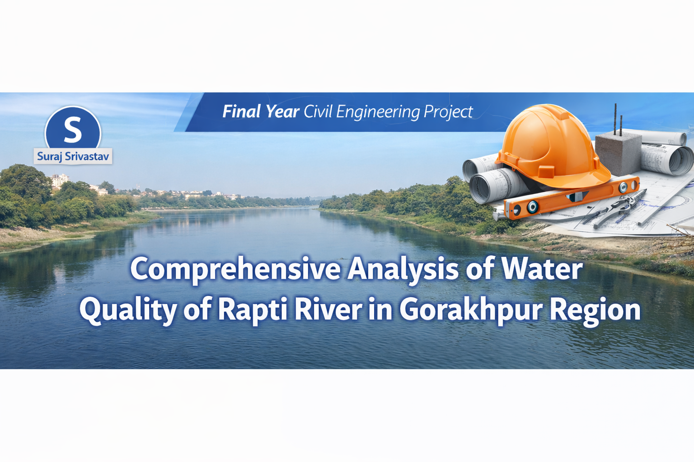

#
# Comprehensive Analysis of Water Quality of Rapti River in Gorakhpur Region

## 📌 Project Overview

This project focuses on the comprehensive analysis of the water quality of the Rapti River in the Gorakhpur region. The study evaluates different physical, chemical, and biological parameters of water to determine the overall water quality and environmental condition of the river.

## 🎯 Objectives

* To analyze the physical and chemical properties of Rapti River water.
* To evaluate water quality parameters such as pH, turbidity, Hardness, Alkalinity,  and Total Dissolved Solids.
* To assess the pollution level and environmental impact on the river.
* To suggest measures for improving water quality.

## 🧪 Parameters Studied

* pH Level
* Turbidity
* Hardhess
* Alkalinity
* Acidity
* Total Dissolved Solids (TDS)

## 📊 Methodology

1. Water samples were collected from different locations along the Rapti River in the Gorakhpur region.
2. Laboratory tests were conducted to analyze various water quality parameters.
3. The obtained results were compared with standard water quality guidelines.

## 🌍 Study Area

Rapti River, Gorakhpur, Uttar Pradesh, India.

## 📁 Project Contents

* Project Report (PDF)
* Data Analysis
* Graphs and Charts
* Field Study Images

## 👨‍🎓 Author

Suraj Srivastav
Civil Engineering Student
